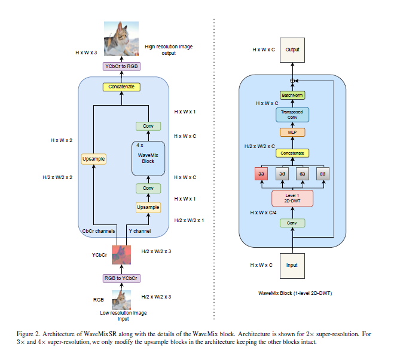

# WaveMixSR

## Introduction

This codebase is based on the research paper titled: "WaveMixSR: Resource-efficient Neural Network for Image Super-resolution". 

Traditionally super resolution is based on transformers which are computationally expensive. This paper introduces a new architecture called WaveMixSR which is based on wavelet transforms. This architecture is computationally efficient offers similar performance to traditional transformer based super resolution models.

## Wavelet Transform

Wavelet transform is a mathematical tool that decomposes a signal into different frequency components. The Fourier transform decomposes a signal into its frequency components. However, the Fourier transform does not provide information about the time at which the frequency components occur. Therefore the Fourier transform in suitabe for stationary signals. One possible solution is to use the short-time Fourier transform which provides information about the time at which the frequency components occur. Choosing the window has compromises. A small window results in a high frequency resolution but a low time resolution. A large window results in a high time resolution but a low frequency resolution.

The wavelet transform improves on the short-time Fourier transform by using a variable window size. The wavelet transform uses a window that is small at high frequencies and large at low frequencies. This results in a high frequency resolution and a high time resolution. Therefore it is called a multi-resolution analysis.

The continuous wavelet transform is defined as:

$$ F(\tau,s) = \frac{1}{\sqrt{\lvert s \rvert}}\int_{-\infty}^{\infty} f(t)\psi^*(\frac{t-\tau}{s}) dt $$

$s$ is the scale parameter which is $\frac{1}{frequency}$. $\psi$ is known as the wavelet. The wavelet acts as a basis function. Previously in the Fourier transfrom, the basis funtions were complexexponentials. The width and central frequency of the wavelet can be changed. An expanded wavelet (large $s$) is suitable for low frequencies with good frequency resolution but bad time resolution and a compressed wavelet (small $s$) is suitable for high frequencies with good time resolution but bad frequency resolution.

$$ \psi_{s,\tau}(t) = \frac{1}{\sqrt{\lvert s \rvert}}\psi(\frac{t-\tau}{s}) $$

where $\psi$ is the mother wavelet. 

This transform results in a 3D plot of the transform with parameters $s$, $\tau$ and $F(\tau,s)$. This is obtained by plotting for different values of $s$ and $\tau$.

If $s$ and $\tau$ are discrete, the wavelet transform is called the discrete wavelet transform. Analysis is efficient if $s$ and $\tau$ are powers of $2$. The equation of the discrete wavelet transform is given by:

$$ D(a,b) = \frac{1}{\sqrt{b}}\sum_{n} f[t_m]\psi[\frac{t_m-a}{b}] $$

$a$ represents $\tau$ and $b$ represents $s$. Instead of the integral, the sum is used. $a$ and $b$ are dyadic.

For computation, the signal is passed into low pass and high pass signals.

## Transposed Convolution

Transposed convolution is a way to reverse the downsampling effect of a regular convolution. It increases the spatial dimensions of the input. This is achieved by inserting zeros between elements of the input feature map before applying the convolution operation. The size of the output feature map depends on several factors, including the stride, padding, kernel size, and input dimensions. 

## Alternate Approaches

Super Resolution is an ill-posed problem. This is because, a unique solution may not exist and a small change in the input may result in a large change in the output. Traditionally CNNs or transformers were used. Transformers typically outperform CNNs but are computationally expensive. CNNs have inductive priors including locality, translation invariance and heirarchy. This makes CNNs able to learn from small datasets but they fail to capture long range dependencies.

### WaveMixSR

  

 

1. The input image is converted to YCbCr color space. The Y channel represents luminance information while the Cb and Cr channels represent the chrominance information where Cb represents the difference between the blue component and a reference value derived from the luminance and Cr represents the difference between the red component and a reference value derived from the luminance. Y channel is used for parametric learning as it contains most of the details and is less affected by colour changes.

2. Y-channel is sent through a parameter free upsampling layer which upsamples the image based on bilinear or bicubic interpolation.

3. The output of the upsampler is sent to a convolutional layer to increase the number of feature maps.

4.  The output from the convolutional layer is sent to 4 WaveMix blocks connected in series.

5. The output i sent to a convolutional layer to reduce the number of feature maps.

6. The Cb and Cr channels are upsampled seperately using bilinear or bicubic interpolation.

7. The 3 channels are concatenated and sent converted to RGB.

### WaveMix Block

The wavemix block uses a single level of 2D discrete wavelet transform. CNNs use pooling, however wavemix blocks don;t and hence have greater spatial resolution. Each wavemix block contains 4 wavelet filters as $w_{aa}, w_{ad}, w_{da}, w_{dd}$ where $a$ represents approximation and $d$ represents detail. These are concatenated and sent to a Multi Layer Perceptron. Afterwards, the output is sent to a transposed convolutional layer and then batch nom is applied. The output is added to the input of the block.
